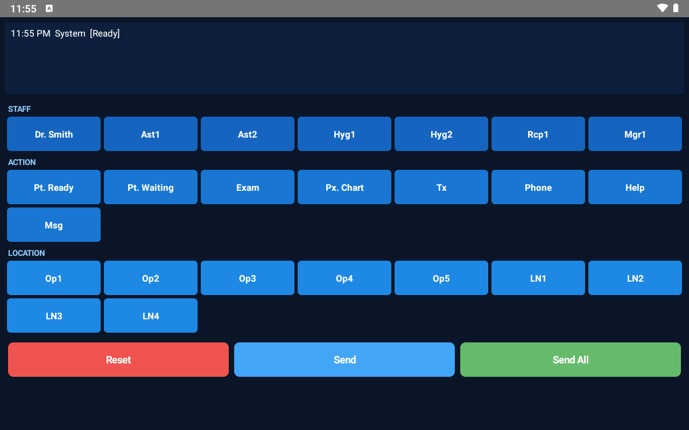
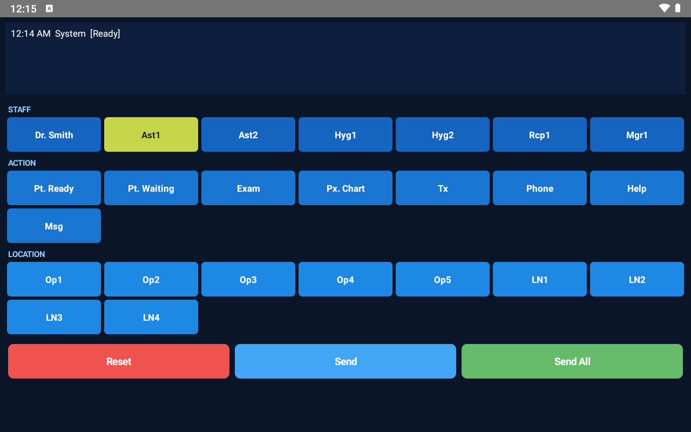
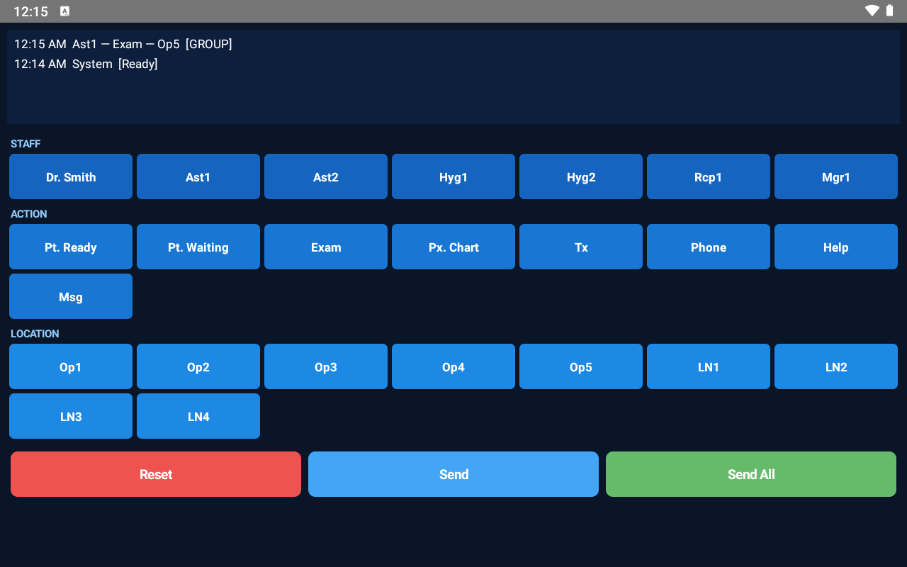

# 🌳 Oak Tree Buzzer

A simple Android intercom app for dental offices. Replaces legacy buzzer/paging systems with tablets on a local network.

**No internet. No server. No accounts. Just tablets on WiFi.**

## Screenshots

| Main Screen | Selection | Message Sent |
|:-----------:|:---------:|:------------:|
|  |  |  |

## How It Works

1. **Select WHO** — tap a staff member (Dr. Smith, Ast1, Hyg1, etc.)
2. **Select WHAT** — tap an action (Pt. Ready, Exam, Phone, Help, etc.)
3. **Select WHERE** — tap a location (Op1-Op5, LN1-LN4)
4. **Tap Send** — message broadcasts to all tablets instantly

Every tablet on the same WiFi network sees the message with a timestamp and buzzer sound.

```
12:07 AM  Ast1 — Phone — Op1  [GROUP]
12:07 AM  Dr. Smith — Exam — Op5  [GROUP]
```

## Features

- **LAN-only** — UDP multicast (239.255.42.1:9876), no internet required
- **Zero configuration** — install APK, connect to WiFi, done
- **HIPAA-friendly** — no data leaves the local network, no cloud, no accounts
- **Buzzer sound** — audible notification on message receive
- **Dark theme** — easy on the eyes in clinical lighting
- **Landscape orientation** — optimized for tablets mounted in operatories

## Quick Start

### Install from APK

1. Download `app-debug.apk` from [Releases](https://github.com/NikolayS/oak-tree-buzzer/releases)
2. Enable "Install from unknown sources" on each tablet
3. Install the APK on every tablet
4. Connect all tablets to the same WiFi network
5. Open the app — done

### Build from Source

```bash
# Clone
git clone https://github.com/NikolayS/oak-tree-buzzer.git
cd oak-tree-buzzer

# Build (requires Android SDK + JDK 17)
./gradlew assembleDebug

# APK at: app/build/outputs/apk/debug/app-debug.apk
```

## Configuration

Staff names, actions, and locations are defined in `MainActivity.java`:

```java
private static final String[] STAFF = {
    "Dr. Smith", "Ast1", "Ast2", "Hyg1", "Hyg2", "Rcp1", "Mgr1"
};

private static final String[] ACTIONS = {
    "Pt. Ready", "Pt. Waiting", "Exam", "Px. Chart", "Tx", "Phone", "Help", "Msg"
};

private static final String[] LOCATIONS = {
    "Op1", "Op2", "Op3", "Op4", "Op5", "LN1", "LN2", "LN3", "LN4"
};
```

Edit these arrays and rebuild. A settings screen is planned for a future release.

## Network Details

- **Protocol:** UDP multicast
- **Group:** `239.255.42.1`
- **Port:** `9876`
- **Message format:** `Staff — Action — Location|TARGET` (UTF-8)
- **TARGET:** `GROUP` (default group) or `ALL` (all devices)

All tablets must be on the same WiFi network. Most consumer/office routers support multicast out of the box. Enterprise networks may need multicast enabled by IT.

## Recommended Hardware

- Any Android tablet running Android 9+ (API 28)
- 7"–10" screen, landscape mounting
- Cheap Amazon Fire tablets work great ($50 each)
- Wall-mount tablet holders for each operatory

## Roadmap

- [ ] Settings screen (edit staff/rooms without recompiling)
- [ ] Acknowledge button on received messages
- [ ] Different buzzer sounds per message type
- [ ] Message history persistence
- [ ] Per-room views (filter by location)
- [ ] Tablet identification (which device is in which room)

## Tech Stack

- Pure Java (no Kotlin, no XML layouts)
- Android SDK 34, minSdk 26
- Zero dependencies beyond AndroidX AppCompat
- UDP multicast for peer-to-peer communication

## License

MIT

---

*Built to replace [legacy dental intercom software](https://github.com/NikolayS/oak-tree-buzzer) that looks like it's from 2005.*
